# 키친포스

## 퀵 스타트

```sh
cd docker
docker compose -p kitchenpos up -d
```

## 요구 사항

### 상품

- 상품을 등록할 수 있다.
- 상품의 가격이 올바르지 않으면 등록할 수 없다.
    - 상품의 가격은 0원 이상이어야 한다.
- 상품의 이름이 올바르지 않으면 등록할 수 없다.
    - 상품의 이름에는 비속어가 포함될 수 없다.
- 상품의 가격을 변경할 수 있다.
- 상품의 가격이 올바르지 않으면 변경할 수 없다.
    - 상품의 가격은 0원 이상이어야 한다.
- 상품의 가격이 변경될 때 메뉴의 가격이 메뉴에 속한 상품 금액의 합보다 크면 메뉴가 숨겨진다.
- 상품의 목록을 조회할 수 있다.

### 메뉴 그룹

- 메뉴 그룹을 등록할 수 있다.
- 메뉴 그룹의 이름이 올바르지 않으면 등록할 수 없다.
    - 메뉴 그룹의 이름은 비워 둘 수 없다.
- 메뉴 그룹의 목록을 조회할 수 있다.

### 메뉴

- 1 개 이상의 등록된 상품으로 메뉴를 등록할 수 있다.
- 상품이 없으면 등록할 수 없다.
- 메뉴에 속한 상품의 수량은 0 이상이어야 한다.
- 메뉴의 가격이 올바르지 않으면 등록할 수 없다.
    - 메뉴의 가격은 0원 이상이어야 한다.
- 메뉴에 속한 상품 금액의 합은 메뉴의 가격보다 크거나 같아야 한다.
- 메뉴는 특정 메뉴 그룹에 속해야 한다.
- 메뉴의 이름이 올바르지 않으면 등록할 수 없다.
    - 메뉴의 이름에는 비속어가 포함될 수 없다.
- 메뉴의 가격을 변경할 수 있다.
- 메뉴의 가격이 올바르지 않으면 변경할 수 없다.
    - 메뉴의 가격은 0원 이상이어야 한다.
- 메뉴에 속한 상품 금액의 합은 메뉴의 가격보다 크거나 같아야 한다.
- 메뉴를 노출할 수 있다.
- 메뉴의 가격이 메뉴에 속한 상품 금액의 합보다 높을 경우 메뉴를 노출할 수 없다.
- 메뉴를 숨길 수 있다.
- 메뉴의 목록을 조회할 수 있다.

### 주문 테이블

- 주문 테이블을 등록할 수 있다.
- 주문 테이블의 이름이 올바르지 않으면 등록할 수 없다.
    - 주문 테이블의 이름은 비워 둘 수 없다.
- 빈 테이블을 해지할 수 있다.
- 빈 테이블로 설정할 수 있다.
- 완료되지 않은 주문이 있는 주문 테이블은 빈 테이블로 설정할 수 없다.
- 방문한 손님 수를 변경할 수 있다.
- 방문한 손님 수가 올바르지 않으면 변경할 수 없다.
    - 방문한 손님 수는 0 이상이어야 한다.
- 빈 테이블은 방문한 손님 수를 변경할 수 없다.
- 주문 테이블의 목록을 조회할 수 있다.

### 주문

- 1개 이상의 등록된 메뉴로 배달 주문을 등록할 수 있다.
- 1개 이상의 등록된 메뉴로 포장 주문을 등록할 수 있다.
- 1개 이상의 등록된 메뉴로 매장 주문을 등록할 수 있다.
- 주문 유형이 올바르지 않으면 등록할 수 없다.
- 메뉴가 없으면 등록할 수 없다.
- 매장 주문은 주문 항목의 수량이 0 미만일 수 있다.
- 매장 주문을 제외한 주문의 경우 주문 항목의 수량은 0 이상이어야 한다.
- 배달 주소가 올바르지 않으면 배달 주문을 등록할 수 없다.
    - 배달 주소는 비워 둘 수 없다.
- 빈 테이블에는 매장 주문을 등록할 수 없다.
- 숨겨진 메뉴는 주문할 수 없다.
- 주문한 메뉴의 가격은 실제 메뉴 가격과 일치해야 한다.
- 주문을 접수한다.
- 접수 대기 중인 주문만 접수할 수 있다.
- 배달 주문을 접수되면 배달 대행사를 호출한다.
- 주문을 서빙한다.
- 접수된 주문만 서빙할 수 있다.
- 주문을 배달한다.
- 배달 주문만 배달할 수 있다.
- 서빙된 주문만 배달할 수 있다.
- 주문을 배달 완료한다.
- 배달 중인 주문만 배달 완료할 수 있다.
- 주문을 완료한다.
- 배달 주문의 경우 배달 완료된 주문만 완료할 수 있다.
- 포장 및 매장 주문의 경우 서빙된 주문만 완료할 수 있다.
- 주문 테이블의 모든 매장 주문이 완료되면 빈 테이블로 설정한다.
- 완료되지 않은 매장 주문이 있는 주문 테이블은 빈 테이블로 설정하지 않는다.
- 주문 목록을 조회할 수 있다.

## 용어 사전

### 공통

| 한글명   | 영문명          | 설명                                 |
|-------|--------------|------------------------------------|
| 비속어   | profanity    | 키친포스에서 사용할 수 없는 단어들을 의미한다.         | 
| 손님    | guest        | 주문을 하는 사람을 의미한다.                   |
| 사용자   | user         | 키친포스를 사용하는 사람을 의미한다. 여기서는 사장님이 된다. | 
| 가격 정책 | price policy | 키친포스에서 사용하는 가격의 규칙을 의미한다.          | 

### 상품(Product)

| 한글명   | 영문명     | 설명                      |
|-------|---------|-------------------------|
| 상품    | product | 음식을 뜻한다. e.g. 탕후루, 마라탕  |
| 상품 가격 | price   | 상품의 가격으로 0원 이상이다.       |
| 상품명   | name    | 상품의 이름으로 비속어를 포함할 수 없다. |

### 메뉴 그룹(MenuGroup)

| 한글명   | 영문명             | 설명                                           |
|-------|-----------------|----------------------------------------------|
| 메뉴그룹  | menu group      | 여러 메뉴들을 하나의 그룹으로 묶은 것을 의미한다. e.g. 이번 달 추천 메뉴 |
| 메뉴그룹명 | menu group name | 메뉴 그룹의 이름으로 비속어를 포함할 수 없다.                   |

### 메뉴(Menu)

| 한글명      | 영문명           | 설명                                                     |
|----------|---------------|--------------------------------------------------------|
| 메뉴       | menu          | 메뉴 그룹에 속하고, 한개 이상의 상품을 포함하고 있어야 한다. e.g. 후라이드 치킨 세트    |
| 메뉴명      | menu name     | 메뉴의 이름으로 비속어를 포함할 수 없다.                                |
| 메뉴상품     | menu product  | 하나의 메뉴에 포함된 상품과 상품 수량들을 의미한다. e.g. 치킨 1개 + 콜라 500ml 1개 |
| 노출 상태    | displayed     | 메뉴의 숨김/노출 상태를 의미한다.(메뉴가 숨김 상태일때 손님은 주문할 수 없다.)         |
| 메뉴상품의 수량 | quantity      | 메뉴에 포함된 상품의 개수를 의미한다.                                  |
| 메뉴 가격    | price         | 메뉴의 가격으로 0원 이상이다.                                      |
| 숨김 메뉴    | hidden state  | 숨겨진 메뉴를 의미한다.                                          |
| 노출 메뉴    | visible state | 노출된 메뉴를 의미한다.                                          |

### 주문(Order)

| 한글명     | 영문명              | 설명                                           |
|---------|------------------|----------------------------------------------|
| 주문 항목   | order line item  | 주문한 메뉴를 의미한다.                                |
| 주문 종류   | order type       | 주문 종류를 의미한다.                                 |
| 배달      | delivery         | 주문 종류에 속하며 배달로 처리되는 주문을 의미한다.                |
| 포장      | takeout          | 주문 종류에 속하며 테이크아웃으로 처리되는 주문을 의미한다.            |
| 매장 주문   | eat in           | 주문 종류에 속하며 매장 내 식사로 처리되는 주문을 의미한다.           |
| 주문 상태   | order status     | 주문의 진행 상태를 의미한다.                             |
| 주문 접수 중 | waiting          | 주문이 접수되었으나 아직 처리되지 않은 상태를 의미한다.              |
| 주문 수락   | accepted         | 주문이 확인되어 상품을 준비 중인 상태를 의미한다.                 |
| 준비 완료   | served           | 상품이 준비가 완료되어 고객에 제공될 수 있는 상태를 의미한다.          |
| 배달 중    | delivering       | 상품이 배달 중인 상태를 의미한다.(주문 종류가 배달 일 때만 존재한다.)    |
| 배달 완료   | delivered        | 상품이 배달 완료가 된 상태를 의미한다.(주문 종류가 배달 일 때만 존재한다.) |
| 주문 완료   | completed        | 주문이 전부 완료된 상태를 의미한다.                         |
| 배달 주소   | delivery address | 배달 주문지를 의미한다. e.g. 서울특별시 … 강남구               |
| 배달 담당자  | delivery rider   | 손님에게 상품을 전달하는 역할을 맡은 외부 대행자를 의미한다.           |

- 매장 주문
    - 주문 접수 중 -> 주문 수락 -> 준비 완료 -> 주문 완료
- 포장
    - 주문 접수 중 -> 주문 수락 -> 준비 완료 -> 주문 완료
- 배달
    - 주문 접수 중 -> 주문 수락 -> 준비 완료 -> 배달 중 -> 배달 완료 -> 주문 완료

### 주문 테이블(OrderTable)

| 한글명         | 영문명                     | 설명                                                        |
|-------------|-------------------------|-----------------------------------------------------------|
| 주문 테이블      | order table             | 손님이 주문을 하는 테이블을 의미한다. e.g. 1번 테이블, 2번 테이블                 |
| 주문 테이블명     | order table name        | 주문 테이블의 이름으로 비속어를 포함할 수 없다.                               |
| 테이블 사용 상태   | occupied                | 손님의 테이블 사용 상태를 의미한다.                                      |
| 테이블 사용 인원   | number of guests        | 해당 테이블을 이용중인 손님의 수를 의미한다.                                 |
| 테이블에 앉음     | sit                     | 테이블에 손님이 앉는다(테이블 사용 여부를 사용으로 변경).                         |
| 테이블을 치움     | clear                   | 테이블에서 손님이 떠난다(테이블 사용 여부를 미 사용으로 변경, 테이블 사용 인원을 0으로 변경).   |
| 테이블 인원 수 변경 | change number of guests | 테이블에 앉은 손님 수를 변경한다(손님의 수는 0 이상이고 테이블을 사용 중일 때만 변경할 수 있다). |
| 테이블 사용 중    | occupied state          | 손님이 테이블을 사용하고 있음을 의미한다.                                   |
| 테이블 미사용 중   | vacant state            | 아무 손님도 해당 테이블을 사용하고 있지 않음을 의미한다.                          |

## 모델링

### 사용자가 상품을 등록할 때

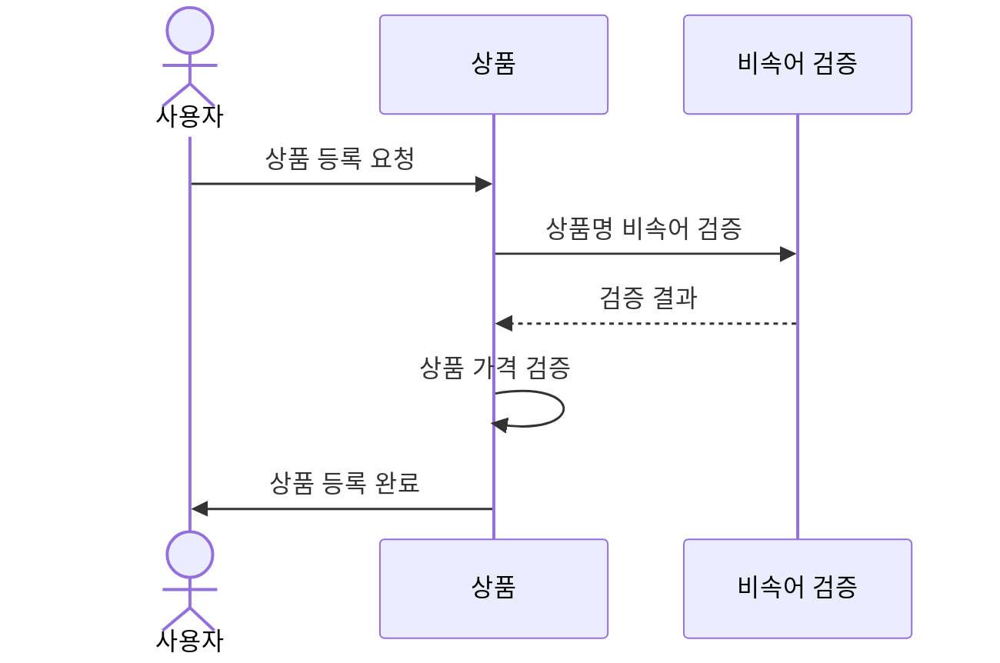
```mermaid
sequenceDiagram
    actor User as 사용자
    participant Product as 상품
    participant ProfanityCheck as 비속어 검증
    User ->> Product: 상품 등록 요청
    Product ->> ProfanityCheck: 상품명 비속어 검증
    ProfanityCheck -->> Product: 검증 결과
    Product ->> Product: 상품 가격 검증
    Product ->> User: 상품 등록 완료
```

#### 상품 등록 정책

- 상품의 가격은 0원 이상이어야 한다.
- 상품의 이름은 비워 둘 수 없다.
- 상품의 이름에는 비속어가 포함될 수 없다.

### 사용자가 메뉴 그룹을 등록할 때

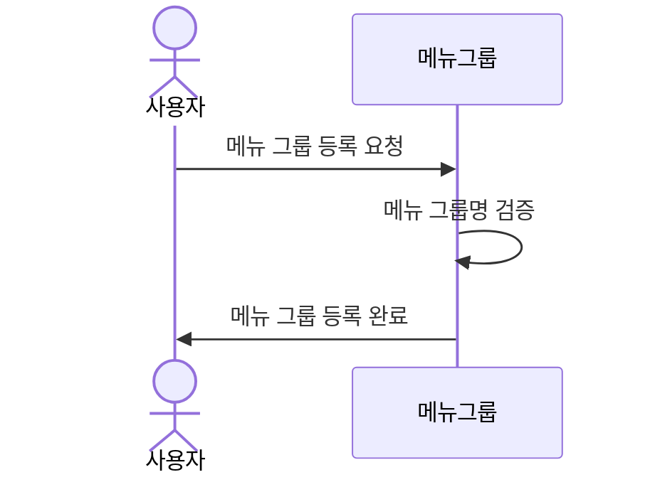
```mermaid
sequenceDiagram
    actor User as 사용자
    participant MenuGroup as 메뉴그룹
    User ->> MenuGroup: 메뉴 그룹 등록 요청
    MenuGroup ->> MenuGroup: 메뉴 그룹명 검증
    MenuGroup ->> User: 메뉴 그룹 등록 완료
```

#### 메뉴 그룹 등록 정책

- 메뉴 그룹의 이름은 비워 둘 수 없다.

### 사용자가 메뉴를 등록할 때

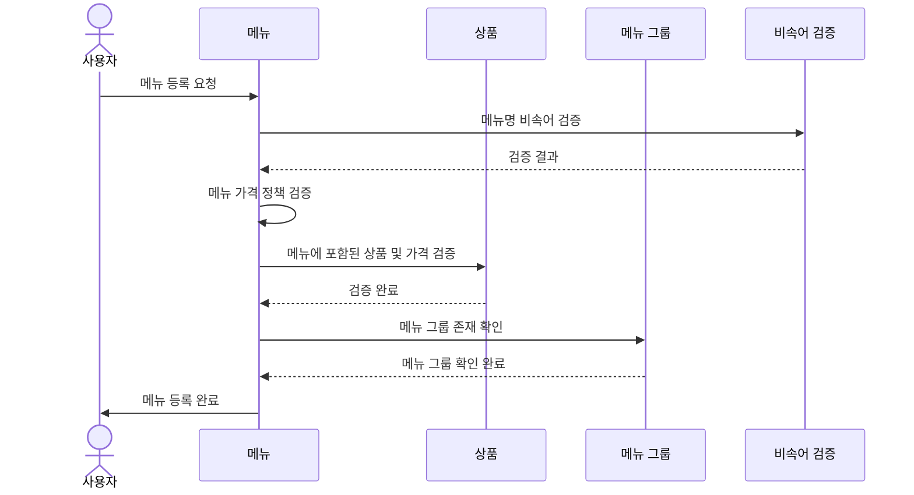
```mermaid
sequenceDiagram
    actor User as 사용자
    participant Menu as 메뉴
    participant Product as 상품
    participant MenuGroup as 메뉴 그룹
    participant ProfanityCheck as 비속어 검증
    User ->> Menu: 메뉴 등록 요청
    Menu ->> ProfanityCheck: 메뉴명 비속어 검증
    ProfanityCheck -->> Menu: 검증 결과
    Menu ->> Menu: 메뉴 가격 정책 검증
    Menu ->> Product: 메뉴에 포함된 상품 및 가격 검증
    Product -->> Menu: 검증 완료
    Menu ->> MenuGroup: 메뉴 그룹 존재 확인
    MenuGroup -->> Menu: 메뉴 그룹 확인 완료
    Menu ->> User: 메뉴 등록 완료
```

#### 메뉴 등록 정책

- 메뉴명 정책
    - 메뉴의 이름은 비워둘 수 없다.
    - 메뉴의 이름에는 비속어가 포함될 수 없다.
    - 비속어 포함 여부는 외부 비속어 검증 서비스에 요청하여 검증한다.
- 메뉴 가격 정책
    - 메뉴의 가격은 0원 이상이어야 한다.
    - 메뉴의 가격이 현재 메뉴에 포함된 상품들의 총합 가격보다 같거나 낮아야 한다.
    - 메뉴의 가격이 메뉴에 속한 상품 금액의 합보다 높을 경우 메뉴를 숨긴다.
- 메뉴에 포함된 상품 정책
    - 메뉴에 포함된 상품의 수량은 0 이상이어야 한다.
    - 메뉴에 포함된 상품의 가격은 가격 정책을 지켜야 한다.
    - 메뉴에 포함된 상품의 가격은 메뉴의 가격보다 크거나 같아야 한다.
- 메뉴 그룹 정책
    - 메뉴는 특정 메뉴 그룹에 속해야 한다.
    - 메뉴 그룹이 존재하지 않으면 메뉴를 등록할 수 없다.

### 사용자가 상품의 가격을 변경할 때

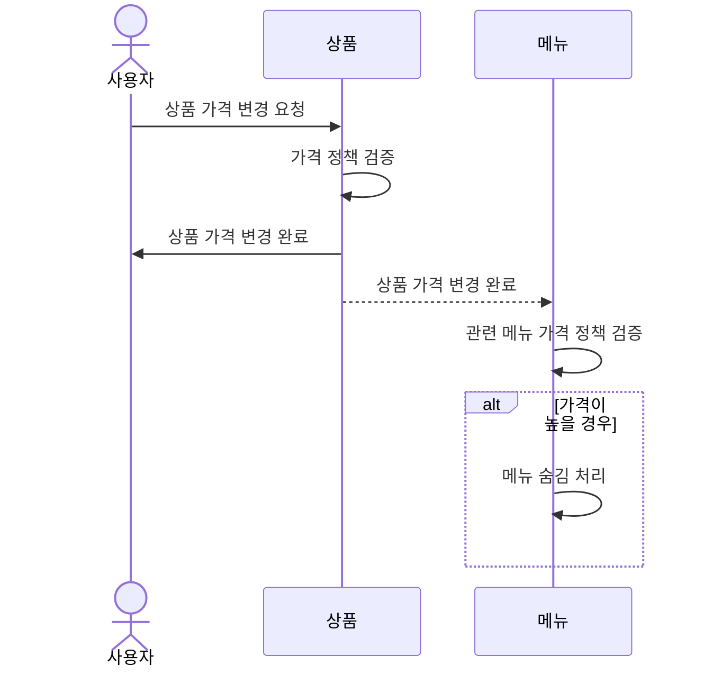
```mermaid
sequenceDiagram
    actor User as 사용자
    participant Product as 상품
    participant Menu as 메뉴
    User ->> Product: 상품 가격 변경 요청
    Product ->> Product: 가격 정책 검증
    Product ->> User: 상품 가격 변경 완료
    Product -->> Menu: 상품 가격 변경 완료
    Menu ->> Menu: 관련 메뉴 가격 정책 검증
    alt 가격이 높을 경우
        Menu ->> Menu: 메뉴 숨김 처리
    end
```

#### 상품 가격 변경 정책

- 상품 가격 정책
    - 변경하려는 가격은 0원 이상이어야 한다.
    - 변경하려는 가격이 비어있으면 안 된다.
- 관련 메뉴 가격 정책
    - 상품이 속해있는 메뉴의 가격과 메뉴에 속해있는 모든 상품들의 가격 합계를 비교한다.
    - 만약 메뉴의 가격이 속해있는 상품들의 총 합계 가격보다 높을 경우, 자동으로 메뉴를 숨김 상태로 설정한다.

### 사용자가 메뉴 가격을 변경할 때

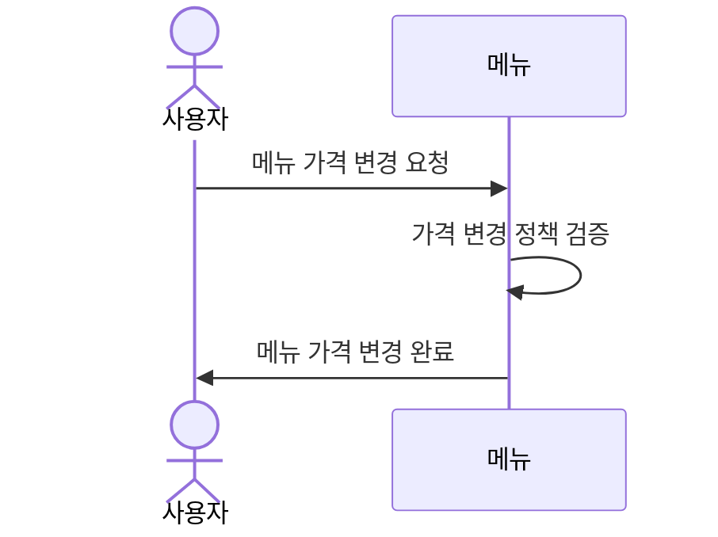
```mermaid
sequenceDiagram
    actor User as 사용자
    participant Menu as 메뉴
    User ->> Menu: 메뉴 가격 변경 요청
    Menu ->> Menu: 가격 변경 정책 검증
    Menu ->> User: 메뉴 가격 변경 완료
```

#### 메뉴 가격 변경 정책

- 변경하려는 가격은 0원 이상이어야 한다.
- 변경하려는 메뉴 가격이 현재 메뉴에 포함된 상품들의 총합 가격보다 같거나 낮아야 한다.

### 사용자가 메뉴를 노출/숨길 때

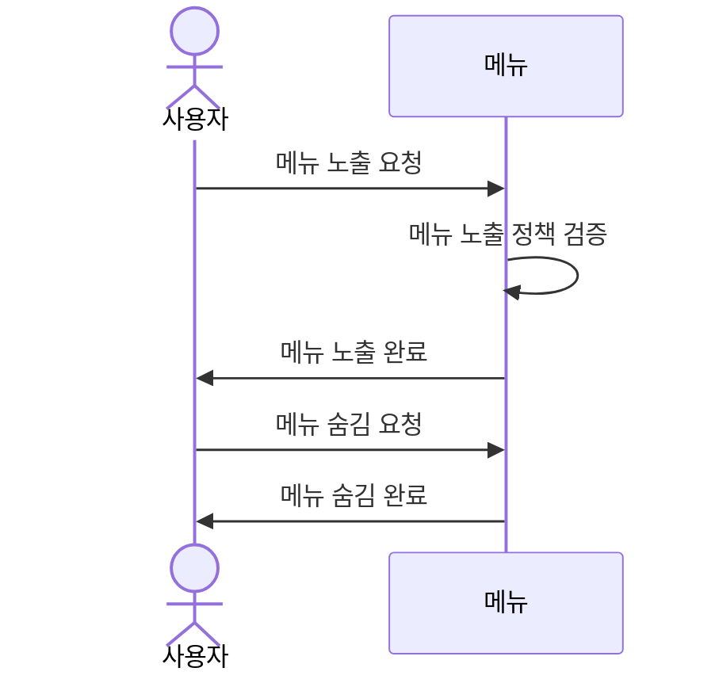
```mermaid
sequenceDiagram
    actor User as 사용자
    participant Menu as 메뉴
    User ->> Menu: 메뉴 노출 요청
    Menu ->> Menu: 메뉴 노출 정책 검증
    Menu ->> User: 메뉴 노출 완료
    User ->> Menu: 메뉴 숨김 요청
    Menu ->> User: 메뉴 숨김 완료
```

#### 메뉴 노출 정책

- 메뉴의 가격은 0원 이상이어야 한다.
- 메뉴의 가격이 현재 메뉴에 포함된 상품들의 총합 가격보다 같거나 낮아야 한다.
- 메뉴에 포함된 상품들의 총합 가격을 검증한다.
- 상품 금액의 합이 메뉴의 가격보다 크거나 같아야 한다.

### 손님이 배달 주문 요청할 때

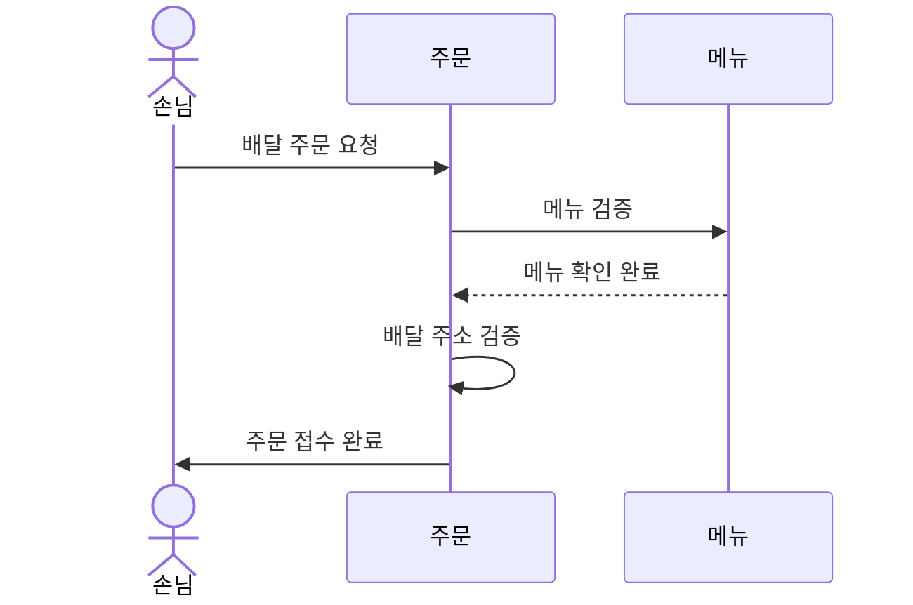
```mermaid
sequenceDiagram
    actor Guest as 손님
    participant Order as 주문
    participant Menu as 메뉴
    Guest ->> Order: 배달 주문 요청
    Order ->> Menu: 메뉴 검증
    Menu -->> Order: 메뉴 확인 완료
    Order ->> Order: 배달 주소 검증
    Order ->> Guest: 주문 접수 완료
```

#### 배달 주문 요청 정책

- 메뉴 검증
    - 메뉴가 등록된 메뉴인지 확인한다.
    - 숨겨진 메뉴는 주문할 수 없다.
    - 주문한 메뉴의 가격이 실제 메뉴 가격과 일치해야 한다.
- 배달 주소 검증
    - 배달 주소는 비워 둘 수 없다.

### 배달 주문을 수락 처리할 때

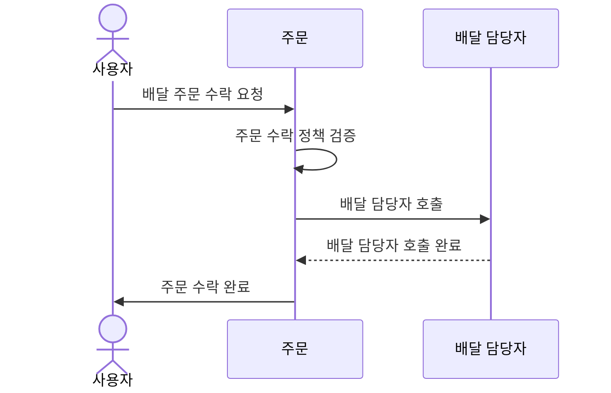
```mermaid
sequenceDiagram
    actor Guest as 사용자
    participant Order as 주문
    participant DeliveryRider as 배달 담당자
    Guest ->> Order: 배달 주문 수락 요청
    Order ->> Order: 주문 수락 정책 검증
    Order ->> DeliveryRider: 배달 담당자 호출
    DeliveryRider -->> Order: 배달 담당자 호출 완료
    Order ->> Guest: 주문 수락 완료
```

#### 배달 주문 수락 정책

- 주문 상태 검증
    - 주문 접수 중인 주문만 주문 수락 할 수 있다.
- 배달 담당자 호출
    - 외부 서비스를 이용하여 배달 담당자를 호출한다.

### 배달 주문을 준비 완료 처리할 때

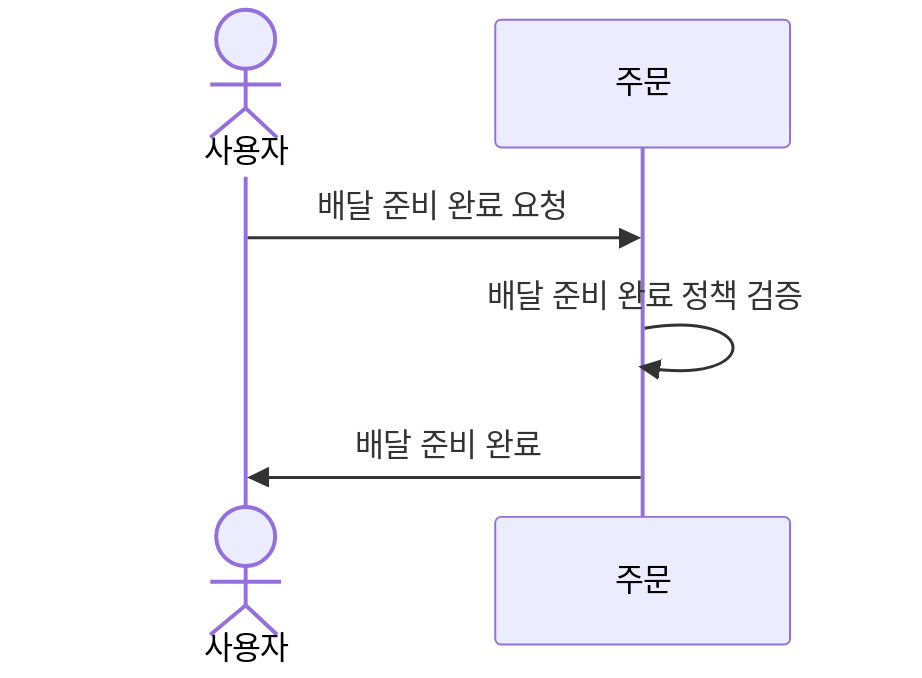
```mermaid
sequenceDiagram
    actor Guest as 사용자
    participant Order as 주문
    Guest ->> Order: 배달 준비 완료 요청
    Order ->> Order: 배달 준비 완료 정책 검증
    Order ->> Guest: 배달 준비 완료
```

#### 배달 준비 완료 정책

- 주문 수락된 주문만 준비 완료 변경할 수 있다.

### 배달 시작 처리할 때

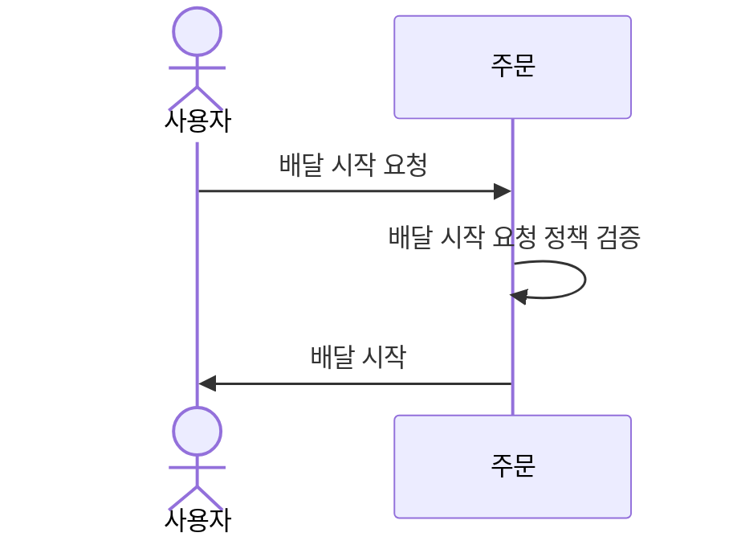
```mermaid
sequenceDiagram
    actor Guest as 사용자
    participant Order as 주문
    Guest ->> Order: 배달 시작 요청
    Order ->> Order: 배달 시작 요청 정책 검증
    Order ->> Guest: 배달 시작
```

#### 배달 시작 요청 정책

- 준비 완료인 주문만 배달 시작 요청할 수 있다.

### 배달 완료 처리할 때

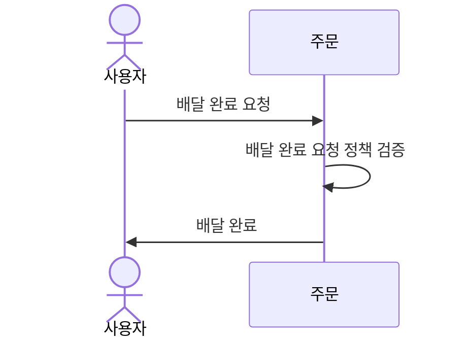
```mermaid
sequenceDiagram
    actor Guest as 사용자
    participant Order as 주문
    Guest ->> Order: 배달 완료 요청
    Order ->> Order: 배달 완료 요청 정책 검증
    Order ->> Guest: 배달 완료
```

#### 배달 완료 요청 정책

- 배달 중인 주문만 배달 완료 요청할 수 있다.

### 배달 주문 완료 처리할 때

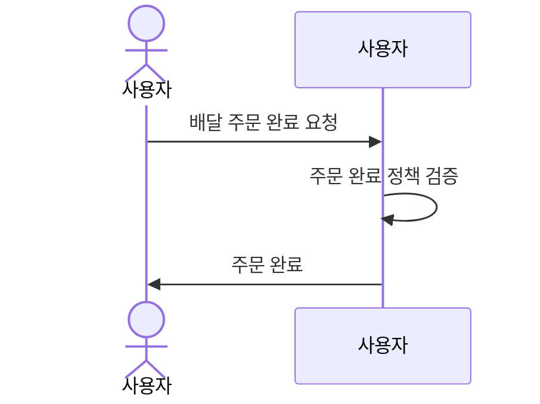
```mermaid
sequenceDiagram
    actor Guest as 사용자
    participant Order as 사용자
    Guest ->> Order: 배달 주문 완료 요청
    Order ->> Order: 주문 완료 정책 검증
    Order ->> Guest: 주문 완료
```

#### 배달 주문 완료 요청 정책

- 배달 완료된 주문만 주문 완료할 수 있다.

### 손님이 포장 주문을 요청할 때

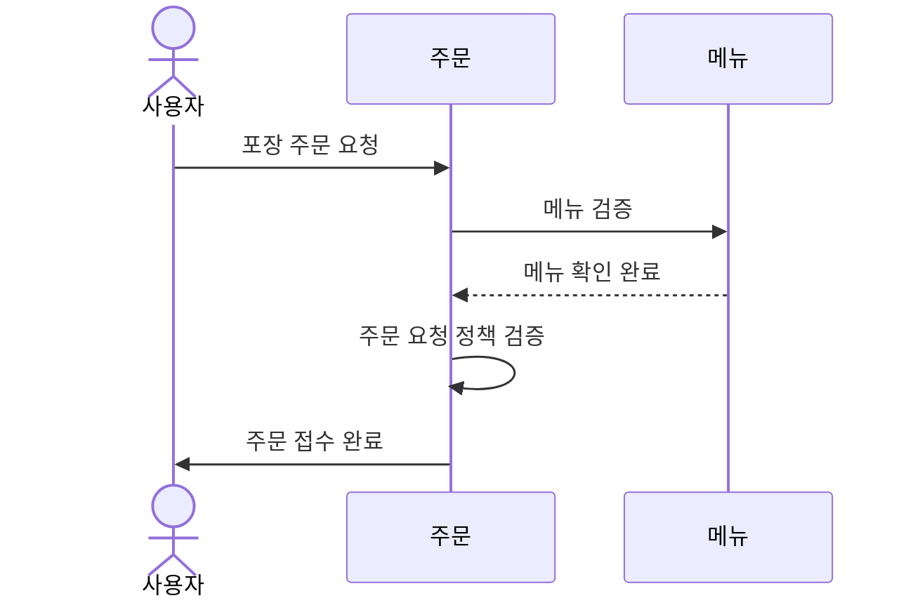
```mermaid
sequenceDiagram
    actor Guest as 사용자
    participant Order as 주문
    participant Menu as 메뉴
    Guest ->> Order: 포장 주문 요청
    Order ->> Menu: 메뉴 검증
    Menu -->> Order: 메뉴 확인 완료
    Order ->> Order: 주문 요청 정책 검증
    Order ->> Guest: 주문 접수 완료

```

#### 포장 주문 등록 정책

- 메뉴 정책
    - 메뉴가 없으면 주문할 수 없다.
    - 숨겨진 메뉴는 주문할 수 없다.
    - 주문한 메뉴의 가격은 실제 메뉴 가격과 일치해야 한다.
- 포장 주문 요청 정책
    - 1개 이상의 등록된 메뉴로 포장 주문을 할 수 있다.

### 포장 주문을 수락 처리 할 때

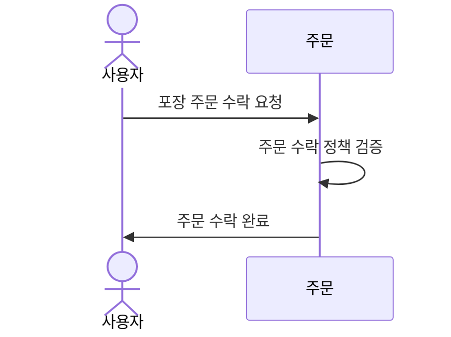
```mermaid
sequenceDiagram
    actor Guest as 사용자
    participant Order as 주문
    Guest ->> Order: 포장 주문 수락 요청
    Order ->> Order: 주문 수락 정책 검증
    Order ->> Guest: 주문 수락 완료
```

#### 포장 주문 수락 정책

- 주문 수락 중인 주문만 주문 수락 할 수 있다.

### 포장 주문을 준비 완료 처리할 때


```mermaid
sequenceDiagram
    actor Guest as 사용자
    participant Order as 주문
    Guest ->> Order: 포장 준비 완료 요청
    Order ->> Order: 주문 준비 완료 정책 검증
    Order ->> Guest: 포장 준비 완료
```

#### 포장 준비 완료 정책

- 주문 수락된 주문만 준비완료 변경할 수 있다.

### 포장 주문을 완료 처리 할 때

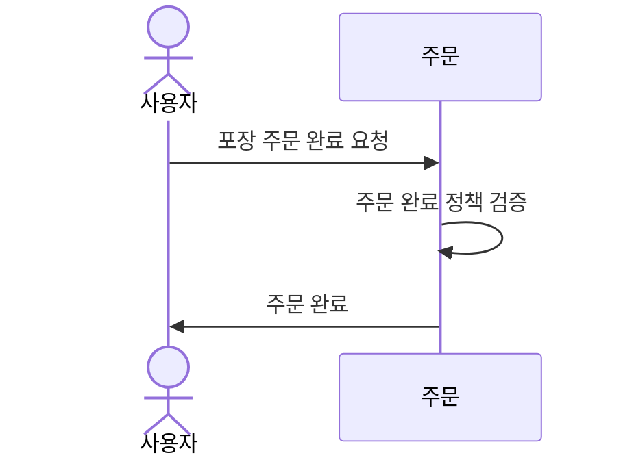
```mermaid
sequenceDiagram
    actor Guest as 사용자
    participant Order as 주문
    Guest ->> Order: 포장 주문 완료 요청
    Order ->> Order: 주문 완료 정책 검증
    Order ->> Guest: 주문 완료
```

#### 포장 주문 완료 요청 정책

- 준비 완료된 주문만 주문 완료할 수 있다.

### 손님이 매장 내 주문 요청할 때

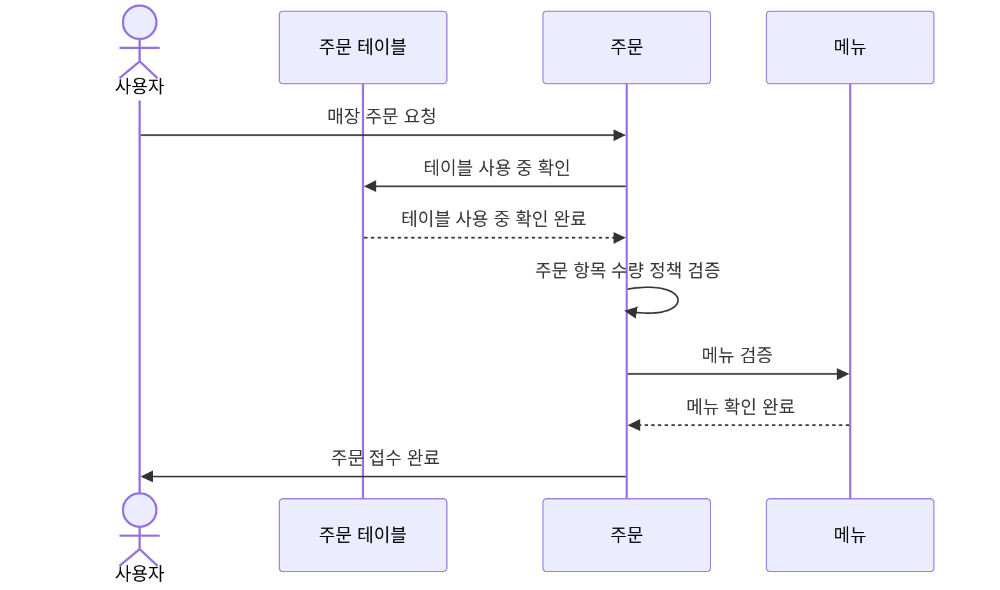
```mermaid
sequenceDiagram
    actor Guest as 사용자
    participant OrderTable as 주문 테이블
    participant Order as 주문
    participant Menu as 메뉴
    Guest ->> Order: 매장 주문 요청
    Order ->> OrderTable: 테이블 사용 중 확인
    OrderTable -->> Order: 테이블 사용 중 확인 완료
    Order ->> Order: 주문 항목 수량 정책 검증
    Order ->> Menu: 메뉴 검증
    Menu -->> Order: 메뉴 확인 완료
    Order ->> Guest: 주문 접수 완료
```

#### 매장 주문 등록 정책

- 메뉴 검증 정책
    - 1개 이상의 등록된 메뉴로 매장 주문을 할 수 있다.
    - 메뉴가 없으면 주문할 수 없다.
    - 숨겨진 메뉴는 주문할 수 없다.
    - 주문한 메뉴의 가격은 실제 메뉴 가격과 일치해야 한다.
- 테이블 사용 상태 정책
    - 테이블을 사용중이지 않으면 주문할 수 없다.
- 주문 항목 수량 정책
    - 매장 주문은 주문 항목의 수량이 0 미만일 수 있다.

### 매장 주문을 수락 처리할 때

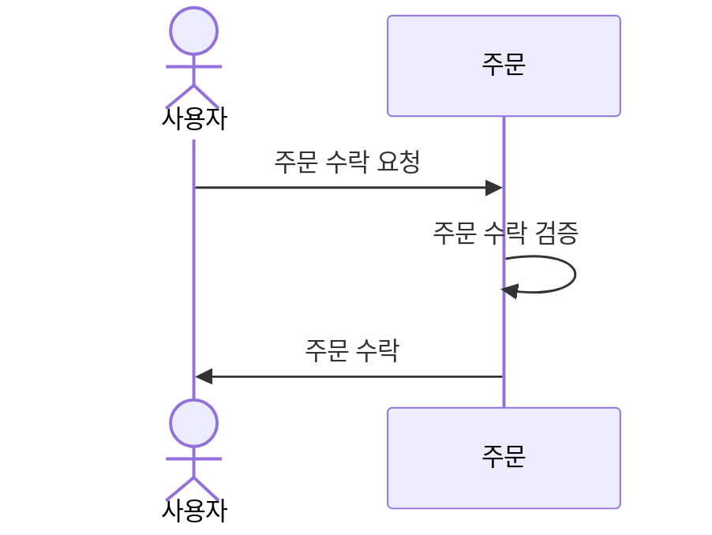
```mermaid
sequenceDiagram
    actor Guest as 사용자
    participant Order as 주문
    Guest ->> Order: 주문 수락 요청
    Order ->> Order: 주문 수락 검증
    Order ->> Guest: 주문 수락
```

#### 매장 주문 수락 정책

- 주문 접수중인 주문만 주문 수락 할 수 있다.

### 매장 주문을 준비 완료 처리할 때

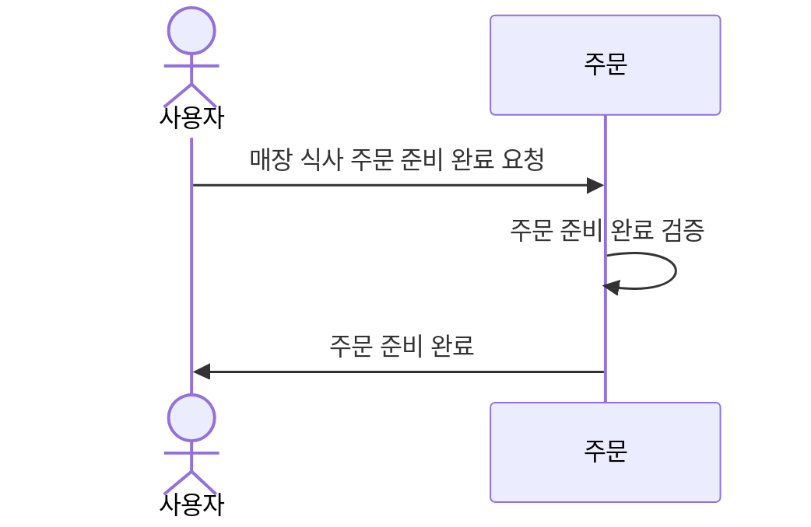
```mermaid
sequenceDiagram
    actor Guest as 사용자
    participant Order as 주문
    Guest ->> Order: 매장 식사 주문 준비 완료 요청
    Order ->> Order: 주문 준비 완료 검증
    Order ->> Guest: 주문 준비 완료
```

#### 매장 주문 준비완료 정책

- 주문 수락된 주문만 준비완료 변경할 수 있다.

### 매장 주문을 주문 완료 처리할 때

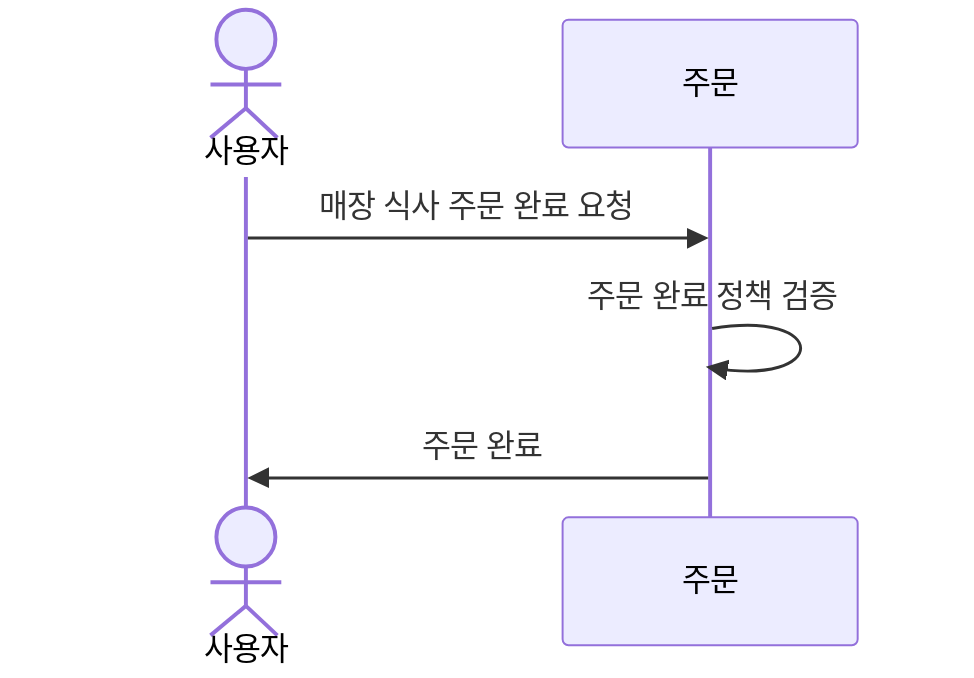
```mermaid
sequenceDiagram
    actor Guest as 사용자
    participant Order as 주문
    Guest ->> Order: 매장 식사 주문 완료 요청
    Order ->> Order: 주문 완료 정책 검증
    Order ->> Guest: 주문 완료

```

#### 매장 주문 완료 정책

- 준비 완료된 주문만 주문 완료할 수 있다.

### 손님이 테이블에 앉을 때

```mermaid
sequenceDiagram
    actor Guest as 손님
    participant OrderTable as 주문 테이블
    Guest ->> OrderTable: 테이블에 앉음 요청
    OrderTable ->> OrderTable: 테이블 상태 검증
    OrderTable ->> Guest: 테이블에 앉음 완료
```

### 테이블 앉음 정책

- 테이블 상태 정책
    - 테이블을 사용 중이지 않을 때만 손님이 앉을 수 있다.
    - 테이블의 사용 상태를 확인하여, 비어 있는 테이블인 경우에만 손님의 앉음 요청을 수락한다.

### 테이블을 치울 때

```mermaid
sequenceDiagram
    actor Guest as 사용자
    participant OrderTable as 주문 테이블
    participant Order as 주문
    Guest ->> OrderTable: 테이블 치움 요청
    OrderTable ->> Order: 주문 완료 상태 확인
    Order -->> OrderTable: 모든 주문 완료 상태 확인
    OrderTable ->> Guest: 테이블 치움 완료
```

#### 테이블 치움 정책

- 주문 완료 상태 정책
    - 테이블을 치우기 전에 해당 테이블의 모든 주문이 완료된 상태인지 확인한다.
    - 주문 테이블이 모든 주문 완료 상태일 때만 테이블을 치울 수 있다.
    - 테이블의 모든 주문이 완료된 상태를 확인한 후, 테이블 치움 요청을 수락한다.
